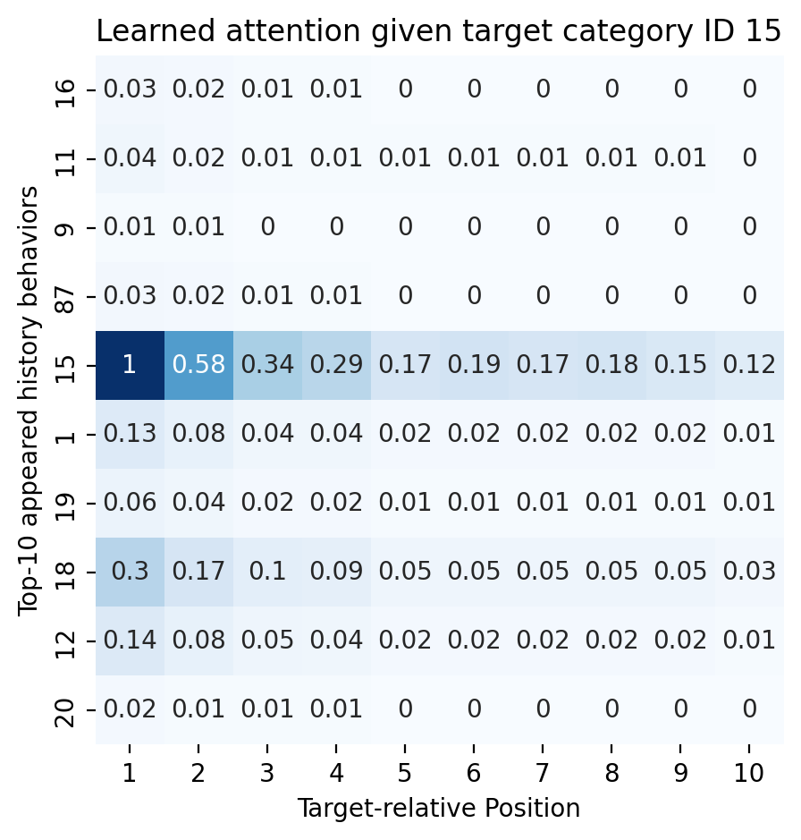
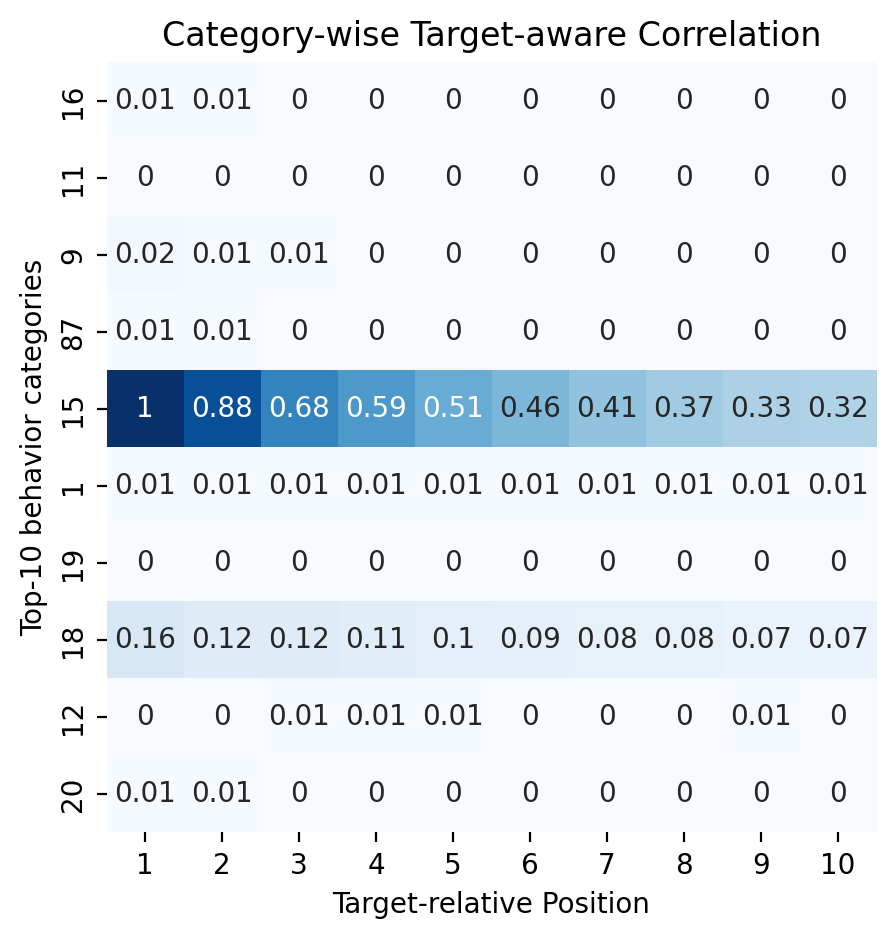
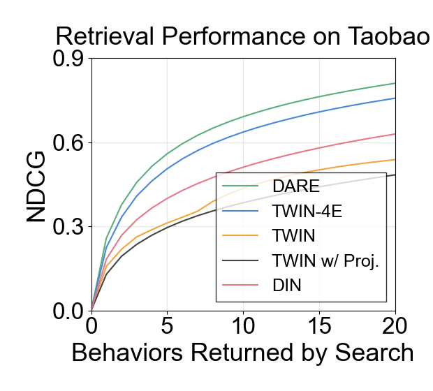
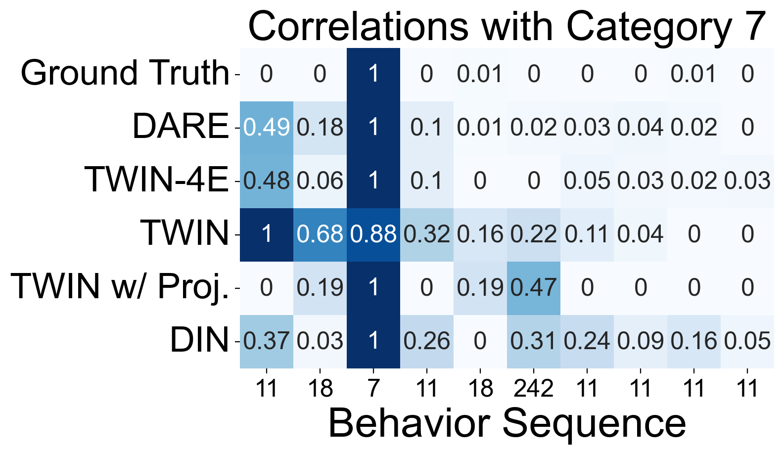
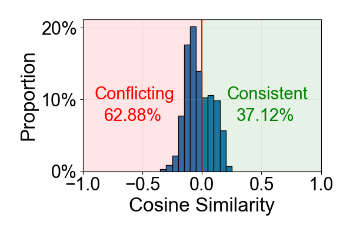
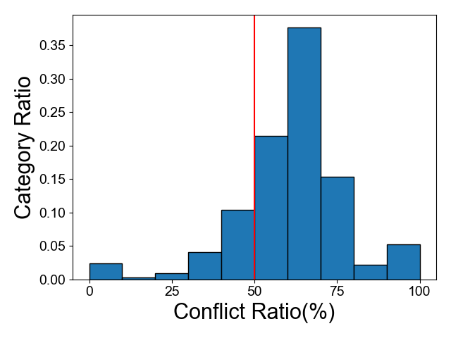
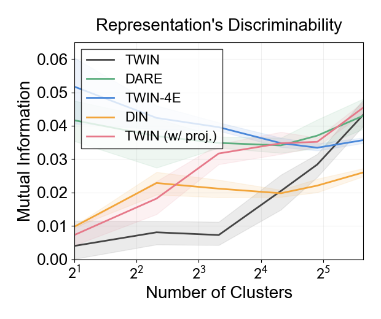
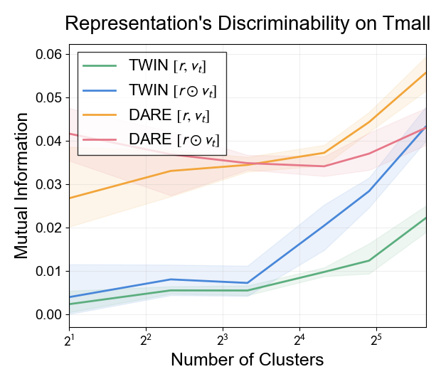

# Long-Sequence Recommendation Models Need Decoupled Embeddings

This repo provides official code for DARE: Decoupled Attention and Representation Embedding model.

## 🔥 News

Our paper have been accepted at **International Conference on Learning Representations** (ICLR 2025).

## 🛠️ Environment

There is no strict limit on package versions. If you like, you can use your existing environment supporting pytorch, and install some packages when you need them. It should not be too difficult. Certainly, You can also create a new conda environment and install dependencies using the following command.

```
conda create --name DARE python=3.7
conda activate DARE
pip install -r requirements.txt
```

## 📦 Dataset

We use the Taobao and Tmall dataset in our code. To download and process the data, please follow [preprocess/README.md](./preprocess/README.md)

## 🚀 Train

We support training **DARE**, **TWIN**, **DIN**, and all their variants in our paper on Taobao and Tmall dataset.
Example instructions are shown in [scripts/Taobao.sh](./scripts/taobao.sh) and [scripts/tmall.sh](./scripts/tmall.sh) (Explanation of the input parameters can be found at the end of this README.md).

For ETA, SDIM and TWIN-V2, their code are not open-source up to now. Please contact the authors of these models for their implementation if you need.

Note that there are **many simple tricks**, and adding or removing them may have some influence on the result.
Besides, there exists some randomness in "Candidate Sampling". So there may be some bias on the absolute result.
But the relative performance gap should be the same as what we report in our paper.

## 🎇 Analysis

Code for analysis are put in [./analysis](./analysis), including analysis for [attention](./analysis/attention_accuracy_analysis),
[gradient](./analysis/gradient_domination_and_conflict_analysis), [representation](./analysis/gradient_domination_and_conflict_analysis)
and [training](./analysis/performance_during_training_analysis). There exists a readme.md in each folder. Follow their commands and
you will get figures like that:

<div style="float: left; width: 99%">


</div>

<div style="float: left; width: 99%">


</div>

<div style="float: left; width: 99%">


</div>

<div style="float: left; width: 99%">


</div>

## 📜 Citation

If you find this project useful, please cite our paper as:

```
@inproceedings{feng2025DARE,
    title={Long-Sequence Recommendation Models Need Decoupled Embeddings}, 
    author={Ningya Feng and Junwei Pan and Jialong Wu and Baixu Chen and Ximei Wang and Qian Li and Xian Hu and Jie Jiang and Mingsheng Long},
    booktitle={International Conference on Learning Representations},
    year={2025},
}
```

## 🤝 Contact

If you have any question, please contact fny21@mails.tsinghua.edu.cn

## 💡 Acknowledgement

Our code is based on [SIM Official Code](https://github.com/tttwwy/sim) and [UBR4CTR](https://github.com/qinjr/UBR4CTR).

