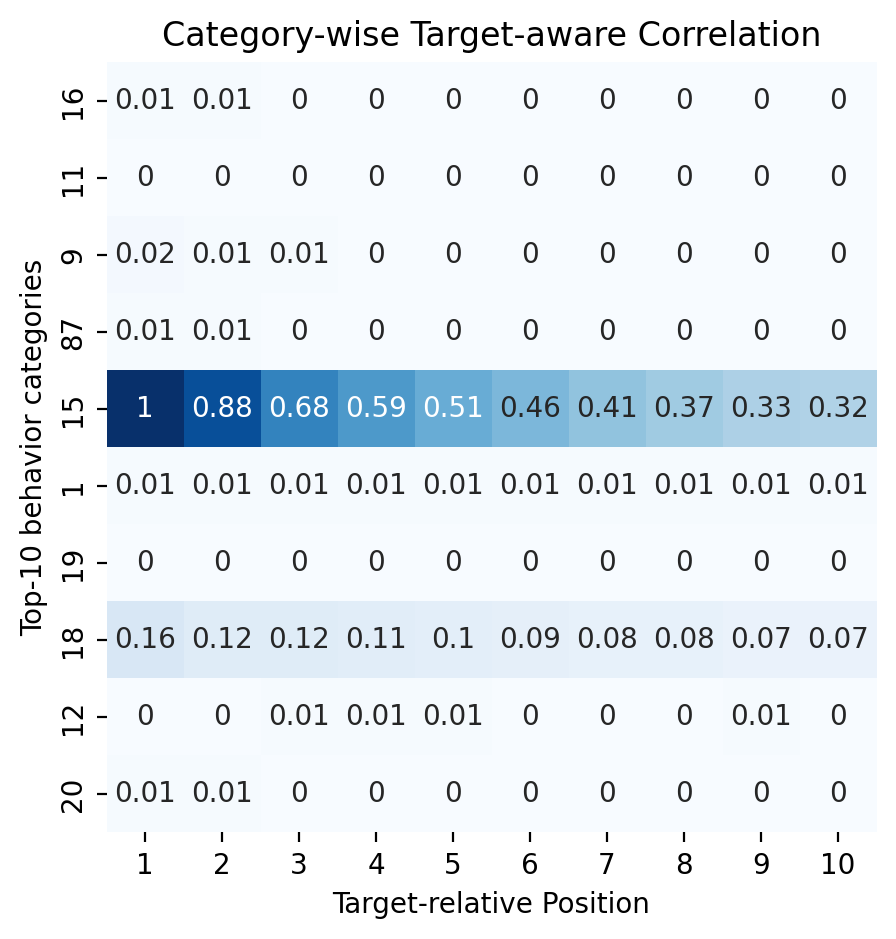
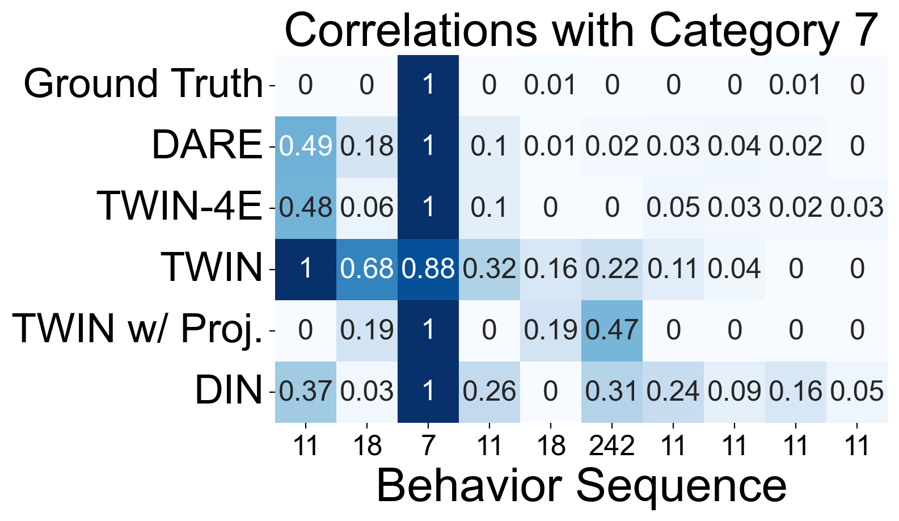

# The analysis of attention accuracy

Note that you may need to add ``sys.path.append(...)`` in the code if some files can't be properly found.

This file shows how to follow our analysis in Section 4.3 "Attention Accuracy" in our paper.

## Compare learned attention and Mutual Information

Run the command in [./script/mi_vs_learned.sh](./script/mi_vs_learned.sh) and you will get figures like that:




## Observe the retrieval performance on the test dataset

Run the command in [./script/gsu_performance.sh](./script/gsu_performance.sh) to analyze the retrieval performance. Then run the following command for visualization:

```
python gsu_performance_draw.py
```

You will get the following figure:


## Case study of retrieval

``gsu_performance_draw.py`` will record the learned correlation score in each test data. To see some case studies, you can run the following command:

```
python case_study.py
```

You will get pictures like that:




